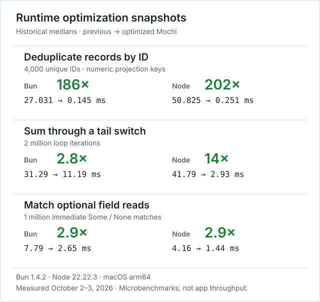

<div align="center">


<h1>mochi</h1>

<p><em>Functional programming that plays nicely with TypeScript.</em></p>

<a href="https://github.com/alanrsoares/mochi/actions/workflows/ci.yml"></a>
<a href="https://app.codspeed.io/alanrsoares/mochi?utm_source=badge"></a>

</div>

Write clean, expressive code with pattern matching and type inference — compiled into
JavaScript you can read, and TypeScript that passes `tsc --strict` with zero errors.

You almost never write a type annotation. The compiler works them out, then hands the
same knowledge to the editor: hover types, `.d.ts` files, and the formatter all come from
the compiler's own passes rather than a separate model of your code. Write
`let x : T = v` at an export or a seam when inference would generalize the wrong shape
([ADR 0044](docs/adr/0044-let-binding-type-annotations.md)).

<div align="center">

</div>

## One language, two clean outputs

Same source. JavaScript with only the runtime helpers it uses; TypeScript with
inferred annotations. Runtime helper definitions are omitted below.

<table>
<tr><th><code>app.mochi</code></th></tr>
<tr><td>

```reason
type User = { name: string, age: number }

let greet = user =>
  switch user.age > 17 {
    | true => "Welcome, ${user.name}"
    | false => "Sorry, ${user.name}"
  }

let birthday = user => { ...user, age: user.age + 1 }
```

</td></tr>
</table>

<table>
<tr><th><code>mochi app.mochi</code> → JavaScript</th><th><code>mochi ts app.mochi</code> → TypeScript</th></tr>
<tr valign="top"><td>

```js
const greet = (user) => ((_v) => _v === true
  ? `Welcome, ${user.name}`
  : _v === false
  ? `Sorry, ${user.name}`
  : (() => { throw new Error("non-exhaustive match"); })())(
    gt(user.age, 17)
  );

const birthday = (user) =>
  ({ ...user, age: add(user.age, 1) });
```

</td><td>

```ts
export type User = { name: string; age: number };

const greet:
  <A>(user: { age: number; name: string } & A) => string
  = <A>(user: { age: number; name: string } & A) =>
    ((_v) => _v === true
      ? `Welcome, ${user.name}`
      : _v === false
      ? `Sorry, ${user.name}`
      : (() => { throw new Error("non-exhaustive match"); })())(
        user.age > 17
      );

const birthday:
  <A>(user: { age: number } & A) => { age: number } & A
  = <A>(user: { age: number } & A) =>
    ({ ...user, age: user.age + 1 });
```

</td></tr>
</table>

Note what the TypeScript column says about `birthday`: it takes *any* record with an
`age`, and gives you back that same record with the extra fields intact. Nobody wrote
that signature. It fell out of inference.

## Quick start

Clone the repo and save the source above as `app.mochi` in its root:

```bash
git clone https://github.com/alanrsoares/mochi.git
cd mochi
bun install
bun run mochi app.mochi          # compile to JS on stdout
bun run mochi ts app.mochi       # compile to strict-clean TypeScript
bun run mochi build app.mochi    # compile a whole module graph
bun run mochi fmt --write app.mochi
```

Run the local playground with `bun run docs:dev`, or browse its
[source](apps/docs).

## Coming from TypeScript

| | TypeScript | mochi |
|---|---|---|
| **Types** | `const add = (a: number, b: number) => a + b` | `let add = (a, b) => a + b` — inferred |
| **Matching** | `switch (r.type) { case "ok": … }`, hope you covered it | `switch r { \| Ok(v) => v \| Err(e) => 0 }` — miss a case, it won't compile |
| **Records** | write an `interface`, then keep it in sync | `{ id: "123", name: "Alice" }` — fields inferred, structural |
| **Optionals** | `?.` and `??` scattered everywhere | `Option`/`Result` variants; the compiler makes you handle the empty case |
| **JSX** | configure `jsx: react-jsx` in tsconfig | built in — compiles to whatever `h()` you point it at |

## The tour

**Variants and exhaustive matching** — no runtime `null` checks, because a missing case
is a compile error.

```reason
type Shape =
  | Circle(number)
  | Rect(number, number)

let area = shape => switch shape {
  | Circle(r) => pi * square(r)
  | Rect(w, h) => w * h
}
```

**Records that don't need an interface** — a function says which fields it uses, and
accepts anything that has them.

```reason
// works on any record with x and y, whatever else it carries
let dist = p => sqrt(square(p.x) + square(p.y))

let d = dist({ x: 3, y: 4, label: "home" })  // 5
```

**Pipelines** — the whole prelude is curried and data-last, so `|>` just works. Sequences
are lazy when you want them to be.

```reason
let doubled = [1, 2, 3] |> map(x => x * 2)           // [2, 4, 6]

let evens = iterate(x => x + 2)(0)                   // 0, 2, 4, 6, …
let firstThree = evens |> take(3) |> toArray     // [0, 2, 4]
```

**Local bindings and destructuring**

```reason
let hypot = (a, b) =>
  let a2 = square(a) in
  let b2 = square(b) in
  sqrt(a2 + b2)

let swap = ((a, b)) => (b, a)          // tuples erase to JS arrays

let sum = xs => switch xs {
  | [] => 0
  | [head, ...tail] => head + sum(tail)
}
```

See [`examples/example.mochi`](examples/example.mochi) for the full tour, and [`examples/`](examples/) for
real programs — a CLI, Game of Life, Snake, async, multi-file module graphs.

## Living with your JS codebase

- **Call any npm package.** Declare an `extern` with a type signature and use it.
- **React and Preact hooks** work inside mochi components — call them directly.
- **Export to TypeScript.** Run `bun run mochi dts --write src` to generate
  `.d.mochi.ts` sidecars, and enable `allowArbitraryExtensions` in `tsconfig.json`.
  Use the Bun preload or Vite plugin to run `.mochi` imports
  ([setup](docs/tooling.md#mochi-in-a-bun-typescript-codebase)).
- **Vite plugin** for `.mochi` files in an existing app.

## Is it real?

mochi compiles itself. The self-hosted compiler in [`bootstrap/`](bootstrap/) emits
TypeScript with **0 `tsc --strict` errors** — verified in CI on every commit, alongside a
fixpoint check that the compiler reproduces itself byte-for-byte. The compiler core
is authored in Mochi; its generated seed and TypeScript host tooling run on
[Bun](https://bun.sh). There is no hand-authored TypeScript compiler twin.

```bash
bun run check        # lint + typecheck + tests
bun run check:full   # + self-host north-stars (what CI runs)
```

## Benchmarks

[CodSpeed](https://app.codspeed.io/alanrsoares/mochi) tracks compiler and tooling
performance in CI. Its current cases compile, infer, load or format source; they
do not run the runtime workloads below. The standalone runtime benchmarks have
their own reproduction scripts and reports.



Workloads and methodology: [record-ID dedupe](docs/dedupe-by-benchmark.md),
[tail-switch sum](docs/tail-switch-benchmark.md), and
[optional-field matches](docs/optional-read-benchmark.md).

These compare earlier Mochi implementations with optimized output, not Mochi
against handwritten JavaScript or TypeScript. They are microbenchmarks, not
application throughput claims. Structural dedupe keys retain the existing scan;
the reports include workload limits, repeat runs and regressions.

```bash
bun run bench                     # compiler, formatter and direct-loop suites
bun scripts/bench-dedupe-by.ts     # previous scan vs primitive projection cache
bun scripts/bench-tail-switch.ts   # previous steps vs scalar tail switches
bun scripts/bench-optional-read.ts # previous wrappers vs immediate-match fusion
```

See [benchmark tooling](docs/tooling.md#benchmarks) for CI coverage, profiling
and saving/comparing local runs.

## Learn more

- [`docs/language.md`](docs/language.md) — the language itself.
- [`docs/compiler.md`](docs/compiler.md) — pipeline, both backends, self-hosting.
- [`docs/tooling.md`](docs/tooling.md) — CLI, LSP, formatter, `.d.ts`.
- [`AGENTS.md`](AGENTS.md) — how to build and contribute.
- [`CONTEXT.md`](CONTEXT.md) · [`docs/adr/`](docs/adr/) — vocabulary and decisions.
