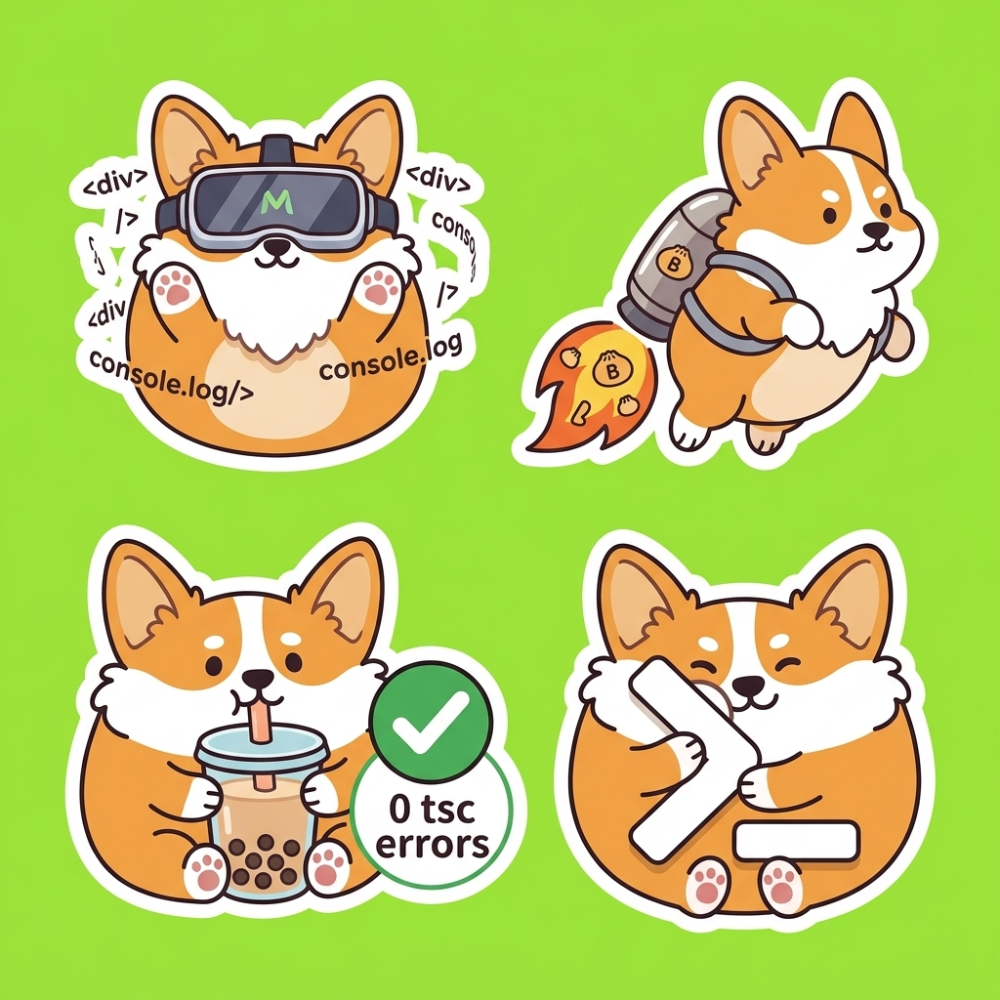
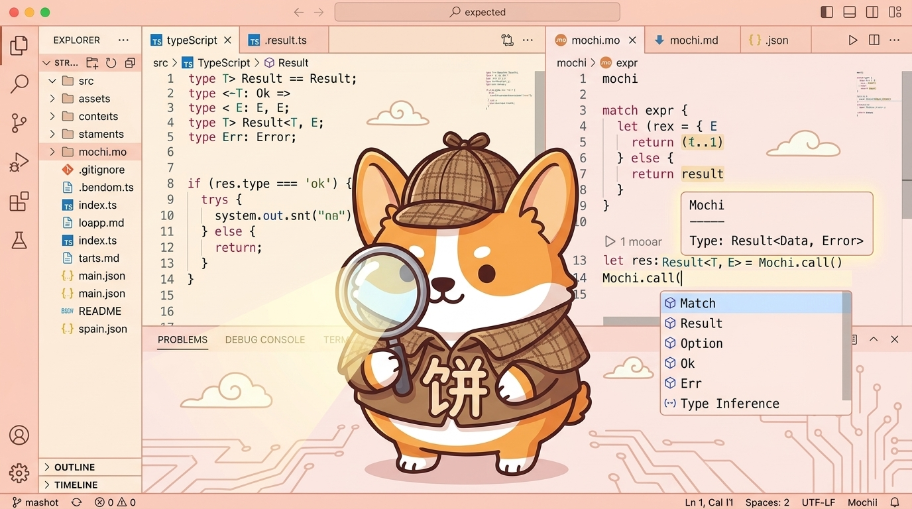
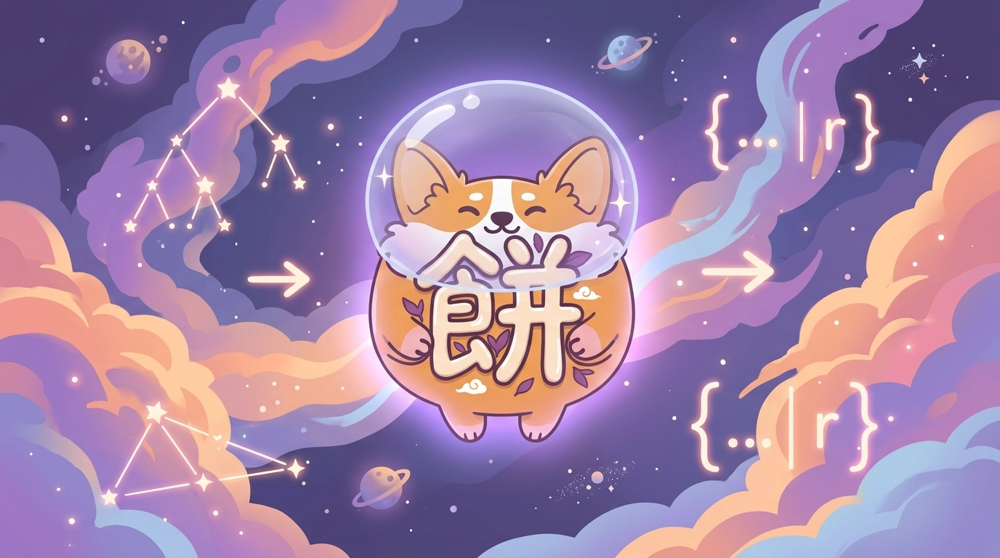

# Mochi Language Illustrations

Official mascot art for **Mochi**, from [`logo.png`](../logo.png).

**UI guidance derived from these plates:** [`AESTHETICS.md`](./AESTHETICS.md)

## Artwork Gallery

### 1. Developer Mascot Banner ([`mochi_coder_mascot.jpg`](./mochi_coder_mascot.jpg))
*Hero illustration for documentation, landing pages, and web banners.*

---

### 2. Compiler Wizard ([`mochi_compiler_magic.jpg`](./mochi_compiler_magic.jpg))
*The Mochi mascot magically compiling functional code into clean JS and strict TypeScript with 0 errors.*

---

### 3. Sticker Sheet & Poses ([`mochi_stickers.jpg`](./mochi_stickers.jpg))
*Die-cut sticker set featuring VR coding, Bun rocket jetpack, boba tea (0 tsc errors), and CLI prompt poses.*

---

### 4. LSP Detective & Inspector ([`mochi_lsp_inspector.jpg`](./mochi_lsp_inspector.jpg))
*The Mochi mascot providing real-time hover tooltips, type hints, and code formatting assistance.*

---

### 5. Cosmic Type System ([`mochi_cosmic_types.jpg`](./mochi_cosmic_types.jpg))
*Astronaut Mochi floating through Hindley-Milner type inference constellations and row polymorphism.*

---

### 6. Bootstrap Celebration ([`mochi_bootstrap_party.jpg`](./mochi_bootstrap_party.jpg))
*Celebrating Mochi's self-hosting milestone with 0 `tsc --strict` compilation errors.*

